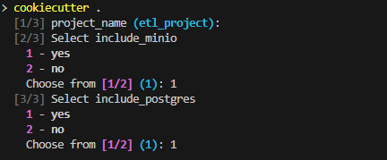

# Python project generator with cookiecutter

This project has for purpose to generate a python project according to several needs.

You can add needed modules in the project.

Right now, only minio and postgres modules are dynamically available.

## Prerequisites

    - python 3
    - cookiecutter lib
    - docker

## Options available in project

In the project you can define some values or add some modules :

1. **Project name**  
   - Allows you to choose project name (by default il will be `etl_project`).

2. **Minio module (optional)**  
   - Add Minio module on separate docker volume.

3. **PostgreSQL Module (optional)**  
   - Add postgres module for data persistence including a dockerized pg_admin client. Postgres and pg_admin share same volume.

## Generating

From the template locally :

```bash
cookiecutter path/to/my_cookie_cutter template
```

From the remote github repository :

```bash
cookiecutter https://github.com/chdem/data-pipeline.git (optional --checkout target/branch)
```


#### A new folder with the chosen name will be created in your current cli dir. Follow the generated README.me in the new folder to setup the generated project.